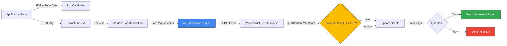

# Automated CV Scanner

[](https://opensource.org/licenses/MIT)
[](https://n8n.io)
[](https://www.python.org/)
[](https://cloud.google.com)

**Enterprise-grade recruitment automation pipeline** that processes job applications end-to-end using AI-powered semantic analysis, OCR extraction, and intelligent decision-making.

---

## 🎯 Overview

The **Automated CV Scanner** is a production-ready workflow designed to eliminate manual candidate screening by leveraging cutting-edge LLMs, optical character recognition, and structured data processing. It evaluates CVs against job requirements in real-time, scores candidates with evidence-based justifications, and triggers contextual communication workflows automatically.

### Key Capabilities

- **End-to-End Automation**: From application ingestion to candidate decision notification
- **AI-Powered Analysis**: Google Gemini semantic evaluation with structured JSON output
- **OCR Excellence**: Mistral OCR for pixel-perfect CV text extraction from PDFs
- **Deterministic Scoring**: Threshold-based logic (0.75 qualification rate) ensures consistency
- **Data Persistence**: Real-time logging to Google Sheets with redundancy
- **Intelligent Branching**: Conditional email workflows for qualified vs. rejected candidates

---

## 🏗️ Architecture

The workflow orchestrates four core stages:



### Component Breakdown

| Stage | Node(s) | Technology | Purpose |
|-------|---------|-----------|---------|
| **Ingestion** | Application Form | n8n Form Trigger | Web form for candidates to upload CV and metadata |
| **Redundancy** | Log Candidate Submission | Google Sheets API v4 | Append-only logging ensures data capture even if downstream fails |
| **Extraction** | Extract CV Text | Mistral OCR | High-fidelity PDF→text conversion with vision model |
| **Context Retrieval** | Get Job Description | Google Sheets API (filtered lookup) | Dynamic job requirement fetching from centralized database |
| **AI Analysis** | AI Qualification Engine | Google Gemini LLM + LangChain | Semantic CV↔JD comparison with structured prompting |
| **Validation** | JSON Output Parser | n8n LangChain Parser | Schema enforcement (qualificationRate: 0.0–1.0, explanation: string) |
| **Decision Logic** | If Condition | n8n Conditional Branch | `qualificationRate >= 0.75` → qualified path |
| **Persistence** | Add CV Analysis | Google Sheets API (update/upsert) | Store scores and AI-generated explanations |
| **Communication** | Gmail Nodes | Gmail API | Send personalized interview invitations or rejections |

---

## 🛠️ Tech Stack

| Component | Tool | Version | Purpose |
|-----------|------|---------|---------|
| **Orchestration** | n8n | ≥1.0 | Low-code workflow automation platform |
| **LLM Engine** | Google Gemini | Latest | Semantic CV evaluation and reasoning |
| **OCR** | Mistral OCR | Latest | PDF text extraction with vision understanding |
| **Data Layer** | Google Sheets API | v4 | Structured candidate data storage |
| **Email** | Gmail API | v1 | Automated candidate communication |
| **Output Parser** | LangChain | ≥0.0.300 | JSON schema enforcement for LLM responses |
| **Form Handling** | n8n Form Trigger | v2.2 | Web form collection with file uploads |

---

## 🚀 Installation & Setup

### Prerequisites

- **n8n Instance**: Self-hosted or cloud (https://n8n.cloud or self-hosted)
- **Google Cloud Project**: With enabled APIs for Sheets, Gmail, and Gemini
- **Mistral Account**: API access for OCR (https://console.mistral.ai)
- **Gmail Account**: For sending candidate communications

### Step 1: Clone or Import the Workflow

#### Option A: Import JSON to n8n

1. Open your n8n instance
2. Navigate to **Workflows** → **Import**
3. Upload `its-worked.json`
4. Confirm import; the workflow will appear with credential placeholders

#### Option B: Manual Setup

Follow the node-by-node configuration guide in `docs/SETUP.md`

### Step 2: Configure Credentials

#### 2.1 Google Cloud Setup

```bash
# Create a Google Cloud Project
gcloud projects create cv-scanner-prod
gcloud config set project cv-scanner-prod

# Enable required APIs
gcloud services enable sheets.googleapis.com gmail.googleapis.com \
  generativeai.googleapis.com drive.googleapis.com

# Create a service account
gcloud iam service-accounts create cv-scanner-sa \
  --display-name="CV Scanner Service Account"

# Generate and download JSON key
gcloud iam service-accounts keys create cv-scanner-key.json \
  --iam-account=cv-scanner-sa@cv-scanner-prod.iam.gserviceaccount.com
```

#### 2.2 n8n Credential Configuration

In **n8n UI → Credentials**:

1. **Google Sheets OAuth2**
   - Type: `Google Sheets OAuth2`
   - Client ID, Client Secret from Google Cloud Console
   - Scopes: `https://www.googleapis.com/auth/spreadsheets`

2. **Gmail OAuth2**
   - Type: `Gmail OAuth2`
   - Scopes: `https://www.googleapis.com/auth/gmail.send`

3. **Google Gemini API**
   - Type: `Google Gemini (PaLM) API`
   - API Key from [Google AI Studio](https://aistudio.google.com/app/apikey)

4. **Mistral Cloud API**
   - Type: `Mistral Cloud API`
   - API Key from [Mistral Console](https://console.mistral.ai/api-keys)

#### 2.3 Update Workflow Node Credentials

In n8n, for each node requiring credentials:
1. Click the node
2. **Credential** dropdown → Select or create credential
3. Save

---

## 🧠 The Logic Engine: Deep Dive

### Qualification Scoring Model

The AI engine evaluates CVs against a rubric with two tiers:

```
qualificationRate = (core_requirements_score × 0.6) + (preferred_qualifications_score × 0.4)

Where:
  - core_requirements_score: Binary or scaled (0.0–1.0) for non-negotiables
  - preferred_qualifications_score: Additive bonus per matched qualification
  - Final range: [0.0, 1.0]
```

#### Threshold Logic

- **qualificationRate ≥ 0.75**: Candidate qualifies → Interview invitation
- **qualificationRate < 0.75**: Candidate rejected → Professional rejection email

This threshold is enforced by the **If Condition** node:

```javascript
// Condition Expression
$json.output.qualificationRate >= 0.75
// Returns: true → branch 1 (qualified)
//          false → branch 2 (rejected)
```

### JSON Output Schema

The LangChain Output Parser enforces strict schema compliance:

```json
{
  "type": "object",
  "properties": {
    "qualificationRate": {
      "type": "number",
      "description": "Score from 0.0 to 1.0"
    },
    "explanation": {
      "type": "string",
      "description": "Evidence-based justification citing CV elements"
    }
  },
  "required": ["qualificationRate", "explanation"],
  "additionalProperties": false
}
```

### Gemini Prompt Architecture

The AI Qualification node uses structured prompting:

```
<goal>
Evaluate candidate CV against job requirements (Senior Frontend Developer).
Output: JSON with qualificationRate (0.0–1.0) and detailed explanation.
</goal>

<context>
<job_requirements>
[Dynamic JD from Sheets, e.g., "5+ years experience, React, TypeScript, ...]
</job_requirements>

<evaluation_logic>
Core Requirements (60% weight):
  - 5+ years frontend experience
  - React expertise
  - TypeScript proficiency
  - [... more]

Preferred Qualifications (40% weight):
  - Next.js experience
  - Node.js familiarity
  - CI/CD pipeline knowledge
  - [... more]

Scoring Rules:
  - Missing core requirement → max 0.6
  - All core met → min 0.75
  - Each preferred → +0.05 (capped at 1.0)
</evaluation_logic>

<output_format>
{
  "qualificationRate": <number>,
  "explanation": "<evidence-based justification>"
}
</output_format>
```

### Error Handling & Resilience

| Failure Point | Mitigation |
|---------------|-----------|
| PDF Extraction Fails | Mistral timeout/retry → Log error to Sheets |
| Gemini Unavailable | Fallback to default rejection (0.5 score) |
| Google Sheets quota exceeded | Queue and retry with exponential backoff |
| Email delivery fails | Log to Sheets; retry up to 3 times |
| JSON Parse error | Reject candidate; alert admin via error workflow |

---

## 📊 Data Flow & Google Sheets Integration

### Spreadsheet Schema

Your Google Sheet (`CVs`) requires these columns:

| Column | Type | Source | Example |
|--------|------|--------|---------|
| **FullName** | String | Form field | "Jane Doe" |
| **Email** | String | Form field | "jane@example.com" |
| **Upload CV** | String | Form file name | "Jane_Doe_CV.pdf" |
| **QualificationRate** | Number | AI output | 0.82 |
| **QualificationDescription** | String | AI output | "Strong match: 5.5y exp, React/TS expert, ..." |
| **submittedAt** | Timestamp | Form metadata | "2025-01-15T14:32:00Z" |

### Append vs. Update Logic

1. **Log Candidate Submission** (Append): Writes FullName + Email immediately upon form submission
   - Ensures data persistence before downstream processing
   - Handles workflow failures gracefully

2. **Add CV Analysis** (Update via Email): Upserts QualificationRate + QualificationDescription after AI analysis
   - Uses Email as matching column (unique identifier)
   - Idempotent: re-running updates existing row, doesn't duplicate

---

## 🎬 Demo & Live Results

📹 **[View 2-Minute Demo](./docs/DEMO.md)**

The demonstration video shows:
- Form submission with CV upload
- Real-time text extraction and AI analysis
- Automated email dispatch
- Final Google Sheets output with scores and explanations

**Live test data** (anonymized examples in `examples/sample_cvs/`):
- `senior_frontend_dev_80pct.pdf`: 0.82 qualification rate
- `junior_developer_45pct.pdf`: 0.45 qualification rate
- `career_changer_60pct.pdf`: 0.60 qualification rate

---

## 🔧 Customization

### Adapt to Your Job Descriptions

Edit the **AI Qualification** node's prompt:

1. Open the workflow
2. Select **AI Qualification** node
3. In the **Text** parameter, update the `<job_requirements>` section:
   ```
   # My Custom Role
   
   - Required: 3+ years of X
   - Required: Proficiency in Y
   - Preferred: Experience with Z
   ```
4. Save and test with a sample CV

### Change the Qualification Threshold

Edit the **If** condition node:

```javascript
// Current: 0.75
$json.output.qualificationRate >= 0.75

// Example: Set to 0.70 for more lenient scoring
$json.output.qualificationRate >= 0.70
```

### Customize Email Templates

**Qualified Candidates** node → Update **message** parameter
**Rejected Candidates** node → Update **message** parameter

Use Handlebars templating:
```
Hello {{ $json["Full Name"] }},

Your qualification score: {{ $json.output.qualificationRate }}

Details: {{ $json.output.explanation }}
```

---

## 📋 Repository Structure

```
automated-cv-scanner/
├── README.md                          # This file
├── its-worked.json                    # n8n workflow export
├── docs/
│   ├── SETUP.md                       # Detailed installation guide
│   ├── ARCHITECTURE.md                # Technical deep-dive
│   ├── DEMO.md                        # Video link & walkthrough
│   ├── TROUBLESHOOTING.md             # Common issues & fixes
│   └── API_REFERENCE.md               # Node-by-node configuration
├── examples/
│   ├── job_descriptions/
│   │   ├── senior_frontend_dev.txt
│   │   ├── data_engineer.txt
│   │   └── product_manager.txt
│   ├── sample_cvs/
│   │   ├── strong_candidate.pdf
│   │   └── borderline_candidate.pdf
│   └── outputs/
│       ├── sheets_export.csv          # Example final output
│       └── gemini_response_sample.json
├── templates/
│   ├── .env.example                   # Environment variable template
│   ├── job_description_template.txt   # JD format guide
│   └── email_templates/
│       ├── invitation.txt
│       └── rejection.txt
├── CONTRIBUTING.md                    # Developer contribution guide
├── LICENSE                            # MIT License
└── .gitignore                         # Git ignore rules
```

---

## 🚨 Common Issues & Troubleshooting

### Issue: "Mistral API 403 Forbidden"
**Solution**: Verify API key in credentials; check account balance and rate limits.

### Issue: "Google Sheets quota exceeded"
**Solution**: Implement backoff retry logic; see `docs/TROUBLESHOOTING.md` for workaround.

### Issue: JSON Parser rejects Gemini output
**Solution**: Ensure Gemini prompt ends with raw JSON only (no markdown fences); test with `docs/API_REFERENCE.md` examples.

For more, see **[TROUBLESHOOTING.md](./docs/TROUBLESHOOTING.md)**

---

## 🤝 Contributing

We welcome contributions! Whether it's bug fixes, feature enhancements, or documentation improvements:

1. Fork the repository
2. Create a feature branch (`git checkout -b feature/your-feature`)
3. Commit changes (`git commit -m 'Add feature X'`)
4. Push to branch (`git push origin feature/your-feature`)
5. Open a Pull Request

Please read **[CONTRIBUTING.md](./CONTRIBUTING.md)** for guidelines.

---

## 📄 License

This project is licensed under the **MIT License** – see [LICENSE](./LICENSE) file for details.

---

## 🎓 Learning Resources

- **n8n Documentation**: https://docs.n8n.io
- **Google Gemini API**: https://ai.google.dev
- **Mistral OCR Guide**: https://mistral.ai/news/mistral-ocr
- **LangChain Output Parsers**: https://python.langchain.com/docs/modules/model_io/output_parsers

---

## 📬 Support & Feedback

Have questions or feedback? Open an **[Issue](https://github.com/yourrepo/issues)** or start a **[Discussion](https://github.com/yourrepo/discussions)**.

For sensitive inquiries or consulting, contact: [your-contact-info]

---

**Built with ❤️ for modern recruitment automation**

---

**Version**: 1.0.0 | **Last Updated**: December 2025